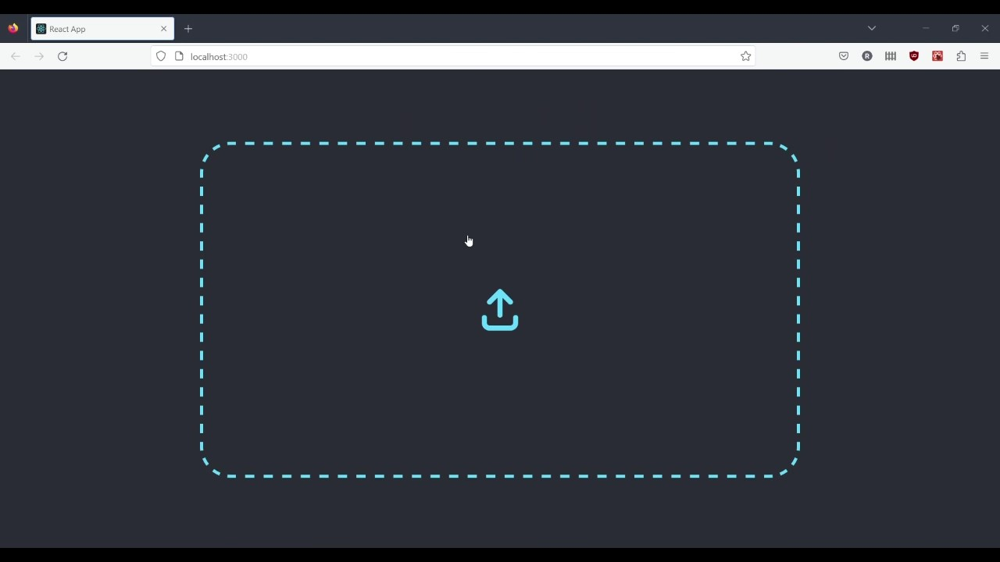
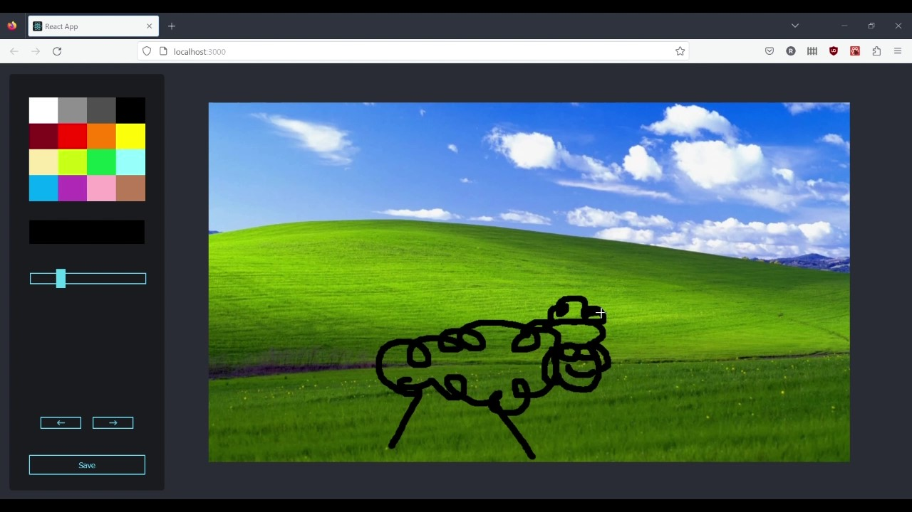

<p float="left">
  
   
</p>

# Demo


https://github.com/ravenstx/image-drawer-app/assets/103364044/ab0aa0f8-5bbb-415e-b0b7-389055b3f085


### This project was made with React and Canvas API

## Installation

```console
git clone https://github.com/ravenstx/image-drawer-app.git
```

## Setup / Usage

_install the dependencies and run_

```
npm install
npm start
```
